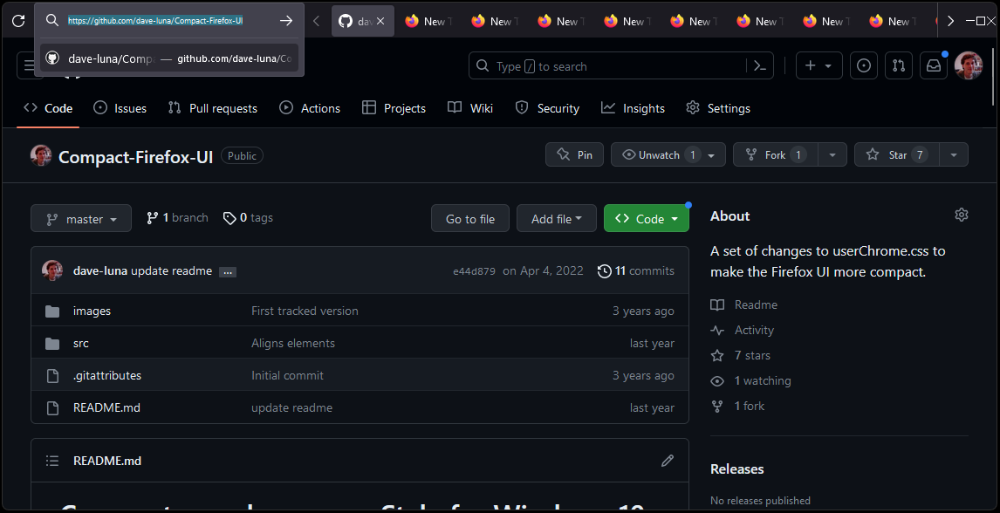
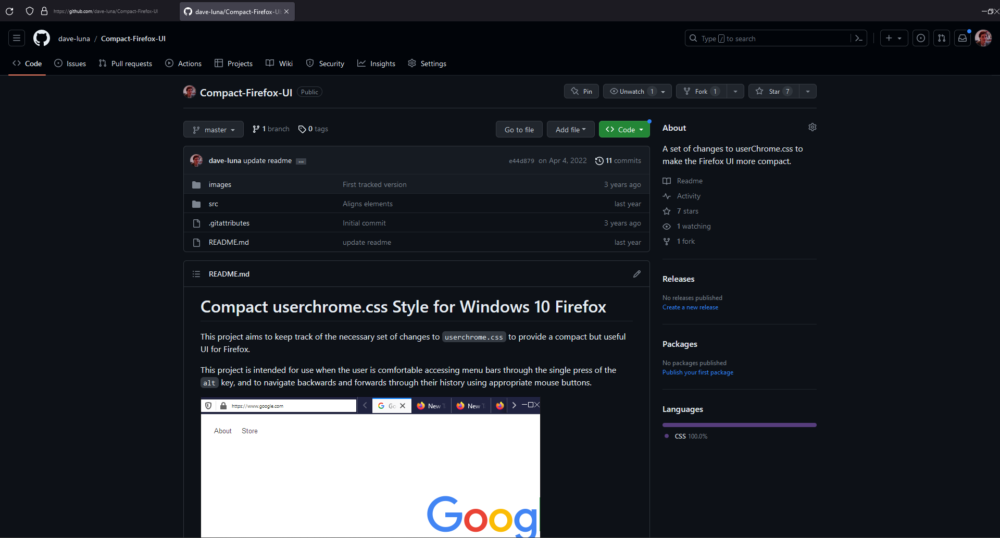
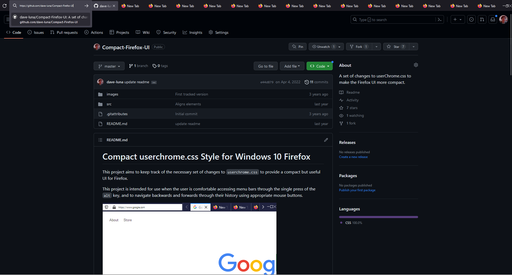
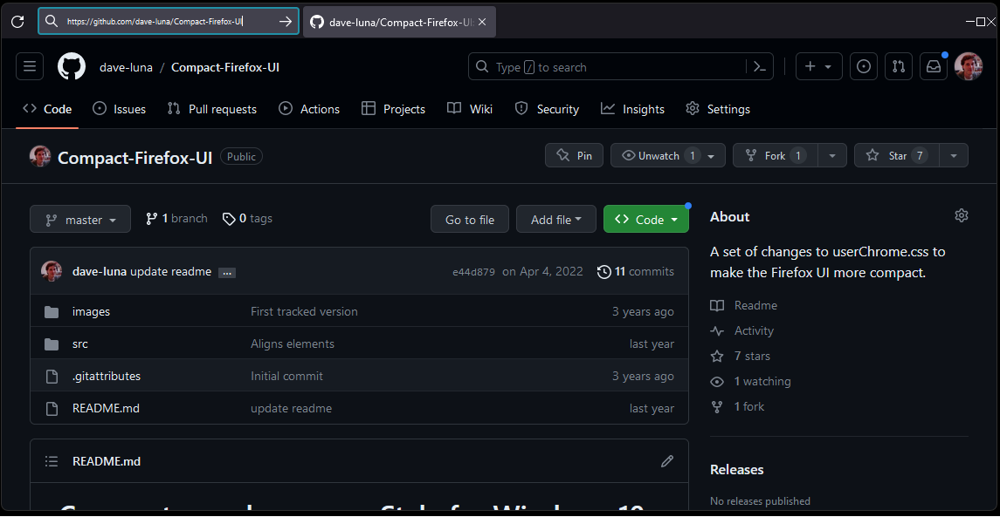

# Compact userchrome.css Style for Windows 10 Firefox

This project aims to keep track of the necessary set of changes to `userchrome.css` to provide a compact but useful UI for Firefox.

This project is intended for use when the user is comfortable accessing menu bars through the single press of the `alt` key, and to navigate backwards and forwards through their history using appropriate mouse buttons.

## Features

Single top-bar containing address bar, tabs (of a fixed width) and the collapse/min/max/close buttons.
Compatible with downloaded themes from within Firefox to allow customization and styling. Works full-screen and windowed.

Fully commented stylesheet should make modifications easy.

Removal of additional extraneous clutter, including:

- Large icons that appear in the context-menu (right-clicking in the web page's body)
- The menu bars that appear within the address bar
- Back and forward buttons in the UI
- The dropdown that appears to the right of the tabs to allow navigation to a specific tab
- Making the collapse/min/max/close buttons less intrusive

### Installation

Copy the `src/userChrome.css` file into your Firefox profile:

1. Navigate in Windows Explorer to `%appdata%\Mozilla\Firefox\Profiles\<profile>\chrome\`. You will need to replace `<profile>` with your unique profile identifier (you can see all profiles by navigating to `%appdata%\Mozilla\Firefox\Profiles\`).
2. Place the copied file in this directory (creating it if necessary).
3. Restart Firefox.

### Supported Version(s)

- Firefox 117.0
- Windows 11 (default or dark theme)

The above configuration is what I run it with personally, and I try to keep up to date. It should work for many older versions though, and hopefully for future versions without the need for constant adjustments.

## Further images

